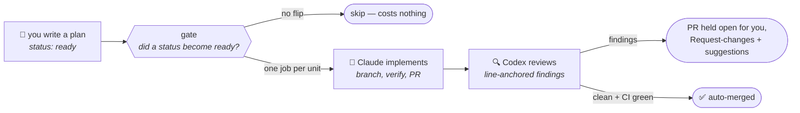

# factory

**Flip a plan to `ready`, push, and read what merged.**

A software factory for any repository with a `plans/` folder: markdown plans
are the work queue, their `status:` frontmatter is the board, and this
repo's reusable workflows are the machine that works it — one agent
implements the plan into a pull request, a second agent from a *different
vendor* reviews it line by line, and a clean verdict plus green CI merges
it. Your job contracts to writing intent at one end and reading diffs at
the other.



Built for and alongside [plans](https://github.com/RatulMaharaj/plans), the
app that renders the `plans/` folder as a board — but callers only need the
folder and its frontmatter conventions, not the app.

## What you get

Three reusable workflows, called from three thin files in your repo:

| You add | It gives you | Triggered by |
| --- | --- | --- |
| `factory.yml` → [`dispatch.yml`](.github/workflows/dispatch.yml) | A plan flipped to `ready` becomes a pull request — one matrix job per unit, routed by the plan's `model:`/`effort:` frontmatter | pushing a `ready` flip, on **any branch** |
| `factory-review.yml` → [`review.yml`](.github/workflows/review.yml) | Every factory PR reviewed by Codex: findings as a **Request-changes** review anchored to their lines, with one-click ```suggestion``` blocks; `CLEAN` + green CI **auto-squash-merges** | factory PRs opening or updating |
| `factory-commands.yml` → [`commands.yml`](.github/workflows/commands.yml) | `/factory implement [model] [effort]` turns an **issue** into a plan, an implementation, and a PR that closes it; `/factory review` runs the review on **any PR**, on demand | comments from write-access users |

And what every run comes with, because it's built in — not configuration:

- **A spend button, not a poller.** The gate diffs each push and dispatches
  only units whose status *became* `ready`. Old ready plans never
  re-dispatch; a push with no flip skips in seconds and costs nothing.
- **Two working modes.** A plan on its own branch is implemented directly
  on that branch — the branch is the workbench and the claim, and the PR
  goes from it into the default branch: *one branch, one PR, per feature*.
  A plan flipped on the default branch builds in a worktree on an `impl/`
  branch instead.
- **Frontmatter routing.** `model: haiku|sonnet|opus`,
  `effort: low|medium|high|xhigh|max` per plan; a feature folder
  (`plans/feature-name/`) is one unit at the highest values any member asks
  for. Invalid values warn and degrade to your defaults — a typo never
  fails a run.
- **Two vendors on purpose.** Claude Code implements (your Claude
  subscription, via OAuth token); Codex reviews (your Codex subscription).
  The reviewer is independent of the model that wrote the code, and the
  two bills don't compete.
- **Bounded, watchable, recorded.** Every run has a turn budget and a
  wall-clock timeout, streams turn-by-turn into the live Actions log, and
  keeps its full transcript as an artifact for two weeks.
- **Guard-railed, never bypassed.** Scoped tool allowlist plus
  `acceptEdits` — a denied call fails the run loudly instead of hanging.
  Pushes only through [`git-push.sh`](scripts/git-push.sh): origin only, no
  flags, and the default branch accepts nothing outside `plans/`.
- **Fail loudly, not creatively.** A plan the agent can't implement goes
  back to `ready` with a note saying what was missing — no half-done PRs,
  no silent stalls.
- **Nothing copied into your repo.** Every job checks this repository out
  at `.factory/` and runs the canonical scripts and skills from there.
  Fixes here reach every caller on its next run — or pin `@v1` to update
  deliberately.

## Install — three files, three secrets, one checkbox

**1. Copy the three files** from [`templates/`](templates/) into your
repo's `.github/workflows/`, and adapt the `with:` inputs to your repo:

```yaml
jobs:
  factory:
    uses: RatulMaharaj/factory/.github/workflows/dispatch.yml@v1
    secrets: inherit
    with:
      runner: ubuntu-latest              # match your CI
      setup: pnpm install                # provision the toolchain
      verify_tools: "Bash(pnpm test:*)"  # your smallest real checks
      default_model: opus                # for plans with no model: hint
```

**2. Add the secrets:**

| Secret | Where it comes from | Required |
| --- | --- | --- |
| `CLAUDE_CODE_OAUTH_TOKEN` | `claude setup-token` locally | yes — the builder |
| `CODEX_AUTH_JSON` | `codex login`, then the contents of `~/.codex/auth.json` | for review/merge |
| `FACTORY_PAT` | a machine account's fine-grained PAT (this repo; Contents + Pull requests read/write; the account a write collaborator) | recommended |

With `FACTORY_PAT`, factory PRs run workflows without approval clicks,
commits carry the machine account's name, and reviews get real
Request-changes/Approve states. Without it everything still works — PRs
are bot-authored, each needs one "Approve and run" click, and reviews post
as comments.

**3. One repo setting:** Settings → Actions → General → allow GitHub
Actions to **create and approve pull requests**.

That's the whole install. A `plans/` folder with the
[frontmatter conventions](skills/plans/SKILL.md) is the only other thing
your repo needs.

## Use

```text
board flow      flip a plan to ready on the default branch, push
branch flow     push a branch carrying a plan flipped to ready
from an issue   comment:  /factory implement       (or: /factory implement opus high)
any PR          comment:  /factory review          (verdict posts; never auto-merges)
```

The lifecycle the board shows while it runs:


## The conventions

Prose is the interface: the dispatched agent literally reads these files
at run time from `.factory/`.

- [`skills/plans/SKILL.md`](skills/plans/SKILL.md) — the plan lifecycle,
  feature folders, and the `model`/`effort` routing keys.
- [`skills/pr/SKILL.md`](skills/pr/SKILL.md) — how a run turns a plan into
  a PR: one unit per run, the claim, branch vs worktree mode, verify, and
  fail-loudly.

## Honest costs

Every dispatch is a paid agent run — the flip (or comment) is the spend
button, and concurrent matrix jobs share your subscription's usage limits
with your interactive sessions. The merge gate is advisory, not
adversarial: a wrong `CLEAN` merges, so oversight means reading what
merged. And merges performed by the workflow don't retrigger workflows on
the base branch (GitHub's recursion guard) — CI ran on the PR, not on the
merge commit.

## Versioning

Pin `@v1` for stability within the major (fixes arrive when the tag
moves); ride `@main` to dogfood the latest. Breaking changes to inputs or
behavior become `@v2`.
