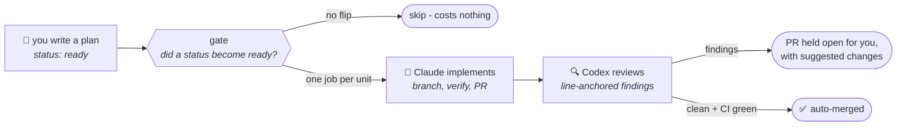
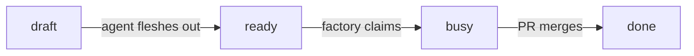

# Factory

**A software development factory for your repo.**

You already write down what you want built. The factory's bet is that a
markdown file with a bit of frontmatter is enough for an agent to build it.
Any repository with a `plans/` folder qualifies: the plans are the work
queue, their `status:` line is the board and the workflows in this repo are
the machine that works it. When you flip a plan to `ready` and push, one
agent implements it into a pull request, an agent from a different vendor
reviews the diff line by line, and if the review is clean and CI is green
the PR merges on its own. Your side of the work shrinks to writing the plan
at one end and reading the diff at the other.



We built this for and alongside
[plans](https://github.com/RatulMaharaj/plans), the app that renders the
`plans/` folder as a board. The factory only needs the folder and its
frontmatter conventions, so you can use it without the app.

## What you get

Three reusable workflows. You call them from three thin files in your own
repo:

| You add | What it does | When it runs |
| --- | --- | --- |
| `factory.yml` → [`dispatch.yml`](.github/workflows/dispatch.yml) | Turns a plan flipped to `ready` into a pull request, one matrix job per unit, routed by the plan's `model:` and `effort:` frontmatter | when a push flips a plan to `ready`, on any branch |
| `factory-review.yml` → [`review.yml`](.github/workflows/review.yml) | Has Codex review every factory PR, with findings anchored to their lines and one-click `suggestion` blocks; a clean verdict plus green CI squash-merges the PR | when a factory PR opens or updates |
| `factory-commands.yml` → [`commands.yml`](.github/workflows/commands.yml) | `/factory implement [model] [effort]` turns an issue into a plan, an implementation and a PR that closes it; `/factory review` runs the review on any PR you point it at | when a user with write access comments |

Every run also comes with the following, and none of it needs configuring.

- **You only pay when you press the button.** The gate diffs each push and
  dispatches only the units whose status became `ready` in that push. This
  means that old ready plans sit on the board without re-dispatching, and a
  push with no flip skips in a few seconds without starting a paid run.
- **Two working modes.** A plan that lives on its own branch is implemented
  directly on that branch: the branch is the workbench and the claim, and
  the PR goes from it into the default branch, so a feature costs you one
  branch and one PR. A plan flipped on the default branch builds in a
  worktree on an `impl/` branch instead, because the base can't be
  committed to.
- **Routing lives in the frontmatter.** `model: haiku|sonnet|opus` and
  `effort: low|medium|high|xhigh|max` route each plan's run. A feature
  folder (`plans/feature-name/`) runs as one unit at the highest values any
  member asks for. A value the dispatcher doesn't recognise gets a warning
  and falls back to your default, so a typo won't fail the run.
- **The builder and the reviewer are different vendors.** Claude Code
  implements, billed to your Claude subscription through an OAuth token.
  Codex reviews, billed to your Codex subscription. This keeps the review
  independent of the model that wrote the code, and it means the two bills
  don't compete for the same usage limits.
- **Every run is bounded and recorded.** A turn budget and a wall-clock
  timeout cap each run, the transcript streams turn by turn into the live
  Actions log, and the full transcript is kept as a job artifact for two
  weeks.
- **Guard rails instead of a permission bypass.** Runs get a scoped tool
  allowlist plus `acceptEdits`, so a denied call fails the run loudly
  instead of hanging it. Pushes only go through
  [`git-push.sh`](scripts/git-push.sh): origin only, no flags, and the
  default branch accepts nothing outside `plans/`.
- **Failure goes back on the board.** A plan the agent can't implement
  returns to `ready` with a note at the top saying what was missing. You
  get the open question written into the plan file instead of a half-done
  PR.
- **Your repo carries no copies.** Every job checks this repository out at
  `.factory/` and runs the canonical scripts and skills from there, so a
  fix here reaches every caller on its next run. Pin `@v1` if you'd rather
  take updates deliberately.

## Install: three files, three secrets, one checkbox

**1. Copy the three files** from [`templates/`](templates/) into your
repo's `.github/workflows/` and adapt the `with:` inputs to your repo:

```yaml
jobs:
  factory:
    uses: RatulMaharaj/factory/.github/workflows/dispatch.yml@v1
    secrets: inherit
    with:
      runner: ubuntu-latest              # match your CI
      setup: pnpm install                # provision the toolchain
      verify_tools: "Bash(pnpm test:*)"  # your smallest real checks
      default_model: opus                # for plans with no model: hint
```

**2. Add the secrets:**

| Secret | Where it comes from | Needed for |
| --- | --- | --- |
| `CLAUDE_CODE_OAUTH_TOKEN` | run `claude setup-token` locally | every implementation run |
| `CODEX_AUTH_JSON` | run `codex login` locally, then save the contents of `~/.codex/auth.json` | review and auto-merge |
| `FACTORY_PAT` | a machine account's fine-grained PAT (this repo; Contents and Pull requests read/write; the account a collaborator with write access) | recommended, see below |

With `FACTORY_PAT`, factory PRs run their workflows without an approval
click, commits carry the machine account's name and reviews arrive as real
Request-changes or Approve states. Without it everything still works: PRs
are authored by the Actions bot, each one needs a single "Approve and run"
click, and reviews post as plain comments.

**3. One repo setting:** Settings → Actions → General → allow GitHub
Actions to **create and approve pull requests**.

That's the whole install. The only other thing your repo needs is a
`plans/` folder that follows the
[frontmatter conventions](skills/plans/SKILL.md).

## Use

```text
board flow      flip a plan to ready on the default branch, push
branch flow     push a branch carrying a plan flipped to ready
from an issue   comment:  /factory implement       (or: /factory implement opus high)
any PR          comment:  /factory review          (the verdict posts; nothing merges)
```

While a run is going, the board tells the story:



## The conventions

The dispatched agent reads these files at run time from `.factory/`, so
this prose is the actual interface between you and the machine:

- [`skills/plans/SKILL.md`](skills/plans/SKILL.md) covers the plan
  lifecycle, feature folders and the `model`/`effort` routing keys.
- [`skills/pr/SKILL.md`](skills/pr/SKILL.md) covers how a run turns a plan
  into a PR: one unit per run, the claim, branch and worktree modes,
  verification and what to do when a plan turns out underspecified.

## What this costs you

Every dispatch is a paid agent run. The flip (or the comment) is the spend
button, and concurrent matrix jobs draw from the same subscription limits
as your interactive sessions, so three plans flipped at once will compete
with whatever you're doing in a terminal.

The merge gate is advisory. A wrong `CLEAN` verdict merges the PR, which
means your oversight moves from clicking merge to reading what merged.
If you want a human click back in the loop, leave out the
`factory-review.yml` caller and merge the PRs yourself.

Merges performed by the workflow use `GITHUB_TOKEN`, and GitHub's recursion
guard means those merges don't trigger workflows on the base branch. CI ran
on the PR; the merge commit itself gets no fresh run.

## Versioning

Pin `@v1` and fixes arrive when we move the tag within the major. Ride
`@main` if you want the latest and are willing to catch the occasional
breakage first. Changes to inputs or behaviour that would break a caller
become `@v2`.
